<div align="center">

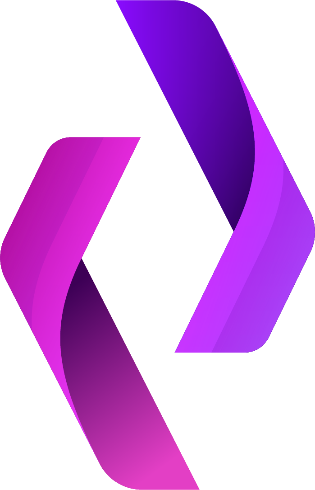

# CodeClone

### Enterprise code‑similarity & clone‑detection platform — AST analysis meets AI.

*Detect copied, renamed, and near‑miss code across 15 languages. Explain it with an LLM. Ship it as a SaaS.*

<br/>

[](https://github.com/yahyaabohashemstu/codeClone/actions/workflows/ci.yml)


**[Features](#features) · [Architecture](#architecture) · [How detection works](#how-detection-works) · [Quick start](#quick-start) · [Deployment](#deployment) · [API](#api) · [Security](#security)**

</div>

---

## Overview

**CodeClone** is a full‑stack platform that answers one question with rigor: *how similar are these two pieces of code, and why?* It combines a language‑agnostic **AST engine** (tree‑sitter), a **UniXcoder** semantic embedding, and an optional **Mistral LLM** narrative into a single calibrated verdict — wrapped in a production SaaS with accounts, quotas, billing, a CI/CD gate, and a multi‑tenant enterprise mode for team code review.

> [!NOTE]
> **Honest scope.** Thresholds are calibrated against a labeled dataset (`evaluation/`), not hand‑picked. The engine is **strong** on Type‑1 (identical), Type‑2 (renamed), and Type‑3 (near‑miss) clones. Type‑4 (behaviourally‑equivalent but structurally different) and **cross‑language** clones are **advisory‑only** — their scores overlap unrelated code with current embeddings. Run `python evaluation/run_eval.py` to reproduce the numbers.

<details>
<summary><b>Table of contents</b></summary>

- [Features](#features)
- [Architecture](#architecture)
- [How detection works](#how-detection-works)
- [Analysis request lifecycle](#analysis-request-lifecycle)
- [Tech stack](#tech-stack)
- [Quick start](#quick-start)
- [Configuration](#configuration)
- [Enterprise platform](#enterprise-platform)
- [Data model](#data-model)
- [API](#api)
- [Deployment](#deployment)
- [Security](#security)
- [Testing](#testing)
- [Project structure](#project-structure)
- [Roadmap & limitations](#roadmap--limitations)
- [License](#license)

</details>

---

## Features

| | Capability | Detail |
|:--:|---|---|
| 🌐 | **Multi‑language detection** | **15 languages** via tree‑sitter — Python, JavaScript, TypeScript, Java, C, Go, Rust, Ruby, PHP, Kotlin, Scala, Elixir, Haskell, Perl, R |
| 🧠 | **Hybrid scoring** | Weighted blend of text, token, AST‑structure, renamed‑structure, and **UniXcoder** semantic signals |
| 🤖 | **AI narratives** | Mistral LLM produces a human‑readable review + a structured risk report (verdict, findings, refactor hints) |
| 🏷️ | **11 clone‑type flags** | Near‑miss, parameterized, function, structural, reordered, gapped, intertwined, semantic… each with a calibrated threshold |
| 👤 | **Accounts & quotas** | Self‑service signup, email verification, password reset, per‑plan monthly quotas (Free / Pro / Team) |
| 🔐 | **Auth hardening** | TOTP 2FA + recovery codes, brute‑force lockout, "log out everywhere", optional breach check |
| 💳 | **Stripe‑ready billing** | Checkout + billing portal + webhooks; quotas work fully offline without Stripe |
| 🏢 | **Enterprise workspaces** | Multi‑tenant org → workspace → RBAC, encrypted‑at‑rest artifacts, scan workers, review cases |
| 🔁 | **CI/CD gate** | `POST /api/v1/ci/check` — fail a pull request when similarity crosses a threshold |
| 📄 | **PDF reports** | Exportable analysis reports with charts and metrics |
| 🌍 | **Bilingual UI** | Full English **and** Arabic (RTL), themeable |
| 📊 | **Observability** | Health/readiness probes, optional Prometheus metrics, optional Sentry |

---

## Architecture

**Same‑origin by design.** The SPA and the API share one origin — no CORS, a `connect-src 'self'` CSP, and SameSite cookies. Flask serves the built React bundle *and* the API from a single process (or behind one reverse proxy).

<div align="center">
  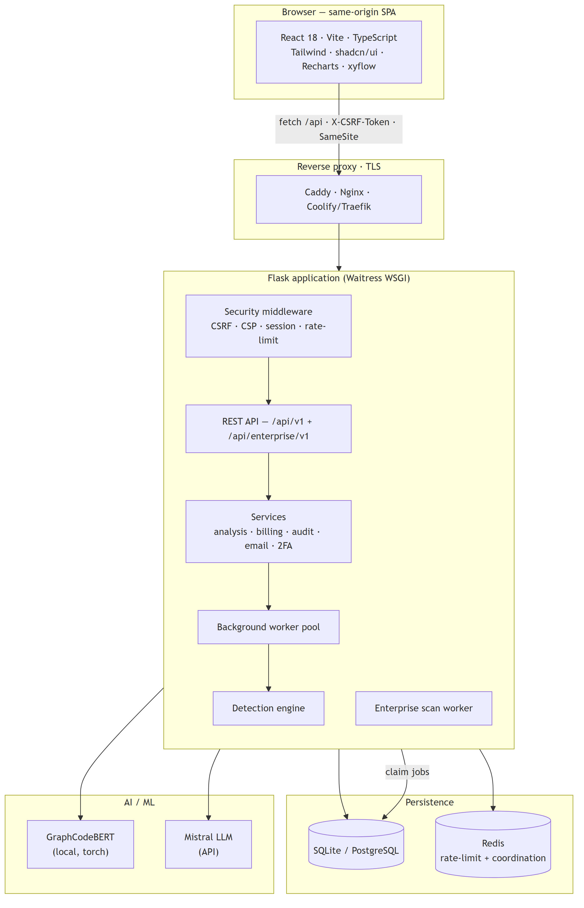
</div>

<details><summary><sub>Diagram source (Mermaid) — renders live on GitHub</sub></summary>

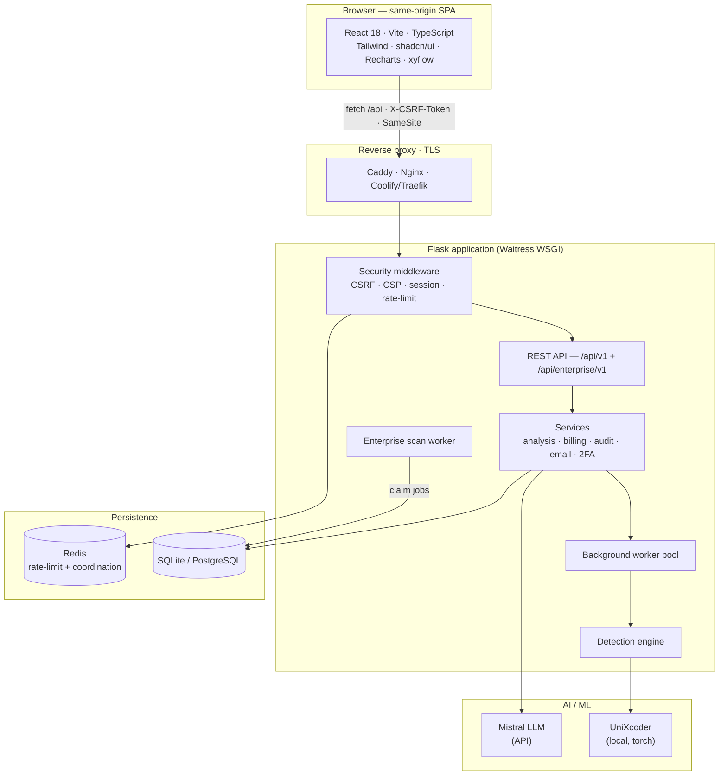

</details>

<details>
<summary><b>Why a single process?</b></summary>

Pointing a separately‑hosted frontend at the API via `VITE_API_BASE_URL` is **not supported** — the backend has no CORS, sends `connect-src 'self'`, and uses SameSite session cookies. Serve the SPA from Flask (`start.bat` / single container) or from the bundled Nginx that reverse‑proxies `/api`. This eliminates an entire class of cross‑origin auth and CSP bugs.

</details>

---

## How detection works

Two snippets flow through five independent signals, blended into one calibrated **combined score**, which then drives eleven boolean clone‑type flags and an optional LLM narrative.

<div align="center">
  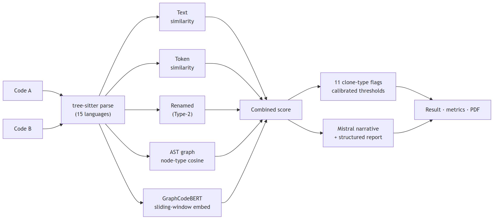
</div>

<details><summary><sub>Diagram source (Mermaid) — renders live on GitHub</sub></summary>

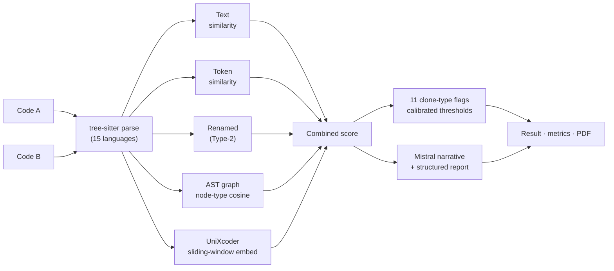

</details>

### Combined‑score weighting

| Signal | Weight | What it captures |
|---|:--:|---|
| Text similarity | **0.20** | Raw textual closeness (fast, whitespace/comment‑sensitive) |
| Token similarity | **0.25** | AST token‑type fingerprint |
| Renamed similarity | **0.25** | Ordered token‑types — best for **Type‑2** (renamed) |
| Graph similarity | **0.15** | Cosine over AST **node‑type frequency** distributions |
| AI (UniXcoder) | **0.15** | Mean‑pooled semantic embedding (chunked over the whole file) |

> [!TIP]
> The UniXcoder step uses a **sliding‑window** with masked pooling (via the attention mask), so files longer than 512 tokens are embedded in full rather than truncated. Unlike the previous GraphCodeBERT encoder — whose non‑clone cosines reached 0.98 and forced a near‑useless 0.985 cutoff — UniXcoder collapses unrelated pairs to a low cosine while clones stay high, so a meaningful ~0.80 boundary exists.
>
> [!NOTE]
> **Calibration — held-out, not in-sample.** `evaluation/results/report.md` is re-run with UniXcoder **and validated on a held-out split**: the zero-false-positive operating threshold is chosen on a deterministic, stratified **train** split and then measured on a **disjoint test** split. Held-out **test** result: **P = 1.0 · R = 0.92 · FPR = 0.0** (pairwise, threshold picked on train = 0.78) and **P = 1.0 · R = 0.85 · FPR = 0.0** (enterprise, 0.91) — an honest generalization estimate, not a training-set fit. UniXcoder gives real separation (easy-negative AI cosine 0.34–0.59 vs clones 0.73–0.98; GraphCodeBERT had *no* such boundary). Remaining honest caveats: 52 pairs is a small corpus, and **Type-4** detection is still only partial (2/5 at 0.80). The regression gate `TestHoldoutEvidence` pins these numbers.

### Clone types

| Type | Meaning | Support |
|---|---|:--:|
| **Type‑1** | Identical up to whitespace/comments | 🟢 Strong |
| **Type‑2** | Renamed identifiers, same structure | 🟢 Strong |
| **Type‑3** | Near‑miss — small edits/insertions | 🟢 Strong |
| **Type‑4** | Same behaviour, different structure | 🟡 Advisory |
| **Cross‑language** | Same logic, different language | 🟡 Advisory |

---

## Analysis request lifecycle

Analysis is asynchronous: the request reserves quota, enqueues a background task, and the SPA polls for progress — so a heavy ML + LLM run never blocks a request thread.

<div align="center">
  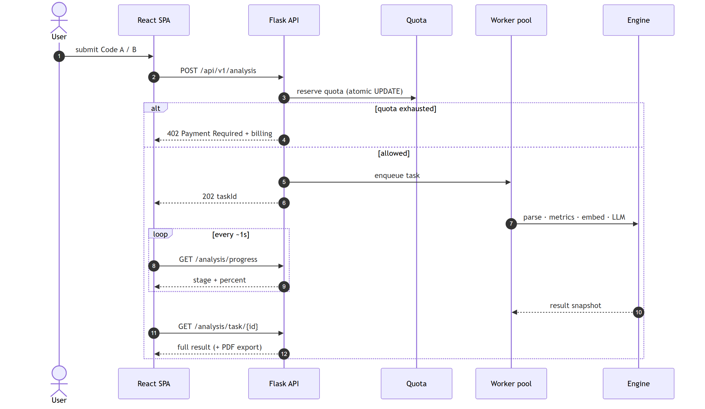
</div>

<details><summary><sub>Diagram source (Mermaid) — renders live on GitHub</sub></summary>

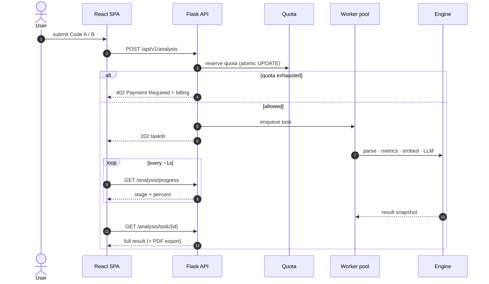

</details>

---

## Tech stack

<table>
<tr><td valign="top" width="50%">

**Backend**
- Flask 3.1 · SQLAlchemy 2 · Flask‑Login
- Waitress WSGI · Flask‑Limiter
- tree‑sitter · RapidFuzz · NetworkX · radon
- PyTorch · Transformers (UniXcoder)
- Mistral AI · pyotp · cryptography
- SQLite / PostgreSQL · Redis · Alembic

</td><td valign="top" width="50%">

**Frontend**
- React 18 · TypeScript 5 · Vite 5
- Tailwind CSS · shadcn/ui (Radix)
- Recharts · @xyflow/react (AST graph)
- react‑router · react‑hook‑form · i18next
- DOMPurify (XSS defense)
- Vitest · Playwright · ESLint

</td></tr>
</table>

---

## Quick start

> **Prerequisites:** Python 3.11+ · Node.js 20+ · ~2 GB RAM (UniXcoder loads into memory).

<details open>
<summary><b>Option A — single server (recommended)</b></summary>

```bash
pip install -r requirements.txt
cp .env.example .env                       # edit as needed
cd code-sleuth-react-ui && npm ci && npm run build && cd ..
python wsgi.py                             # Flask serves the SPA + API on :5000
```

On Windows, `start.bat` does the same.

</details>

<details>
<summary><b>Option B — frontend dev server with hot reload</b></summary>

```bash
python wsgi.py                             # API on :5000
cd code-sleuth-react-ui && npm run dev     # UI on :8080, /api proxied to :5000
```

</details>

<details>
<summary><b>Option C — Docker (one command)</b></summary>

```bash
docker compose -f docker/docker-compose.yml up --build
#  -> http://localhost:3000  (Nginx serves the SPA and proxies /api/*)
```

</details>

> On first run with an empty database a default admin is created; its credentials are printed to `instance/bootstrap_admin_credentials.txt` (or set `DEFAULT_ADMIN_USERNAME` / `DEFAULT_ADMIN_PASSWORD`).

---

## Configuration

Everything is environment‑driven — see **[`.env.example`](.env.example)** for the annotated, exhaustive list. The essentials:

| Variable | Purpose | Default |
|---|---|---|
| `SECRET_KEY` | Session/token signing key | required in prod |
| `DATABASE_URL` | SQLAlchemy URL (Postgres driver bundled) | SQLite in `instance/` |
| `REDIS_URL` | Rate‑limit + coordination store | in‑process `memory://` |
| `TRUST_PROXY_HEADERS` | Trusted proxy hops (set `1` behind a proxy) | `0` |
| `MISTRAL_API_KEY` | Enables AI narratives | — |
| `ENTERPRISE_DATA_KEY` | Encryption key for enterprise data at rest | falls back to `SECRET_KEY` |
| `STRIPE_SECRET_KEY` | Enables billing (else 503, free plan) | — |
| `EMAIL_PROVIDER` | `console` · `smtp` · `disabled` | `console` |
| `CI_API_KEY` | Shared secret for the CI gate | — |

**Plans** (quotas apply with or without Stripe):

| Plan | Monthly analyses | Price |
|---|:--:|:--:|
| Free | 50 | $0 |
| Pro | 1,000 | $19 |
| Team | Unlimited | $99 |

---

## Enterprise platform

A multi‑tenant module for team/course code review: organizations contain workspaces (the tenant boundary), each with role‑based membership, connected repositories, background scans, and human‑reviewed similarity cases.

<div align="center">
  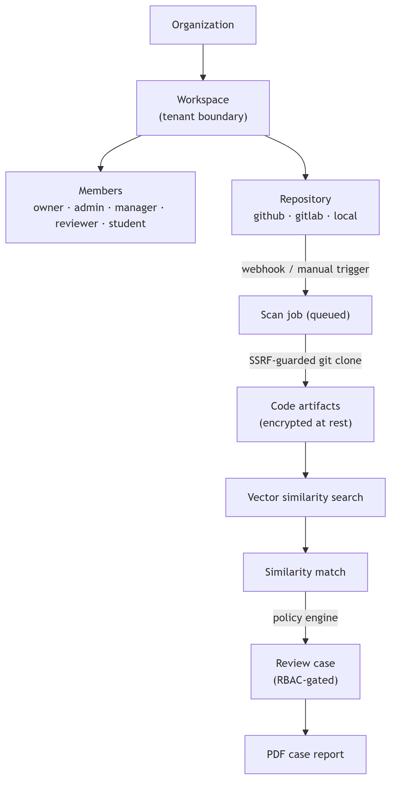
</div>

<details><summary><sub>Diagram source (Mermaid) — renders live on GitHub</sub></summary>

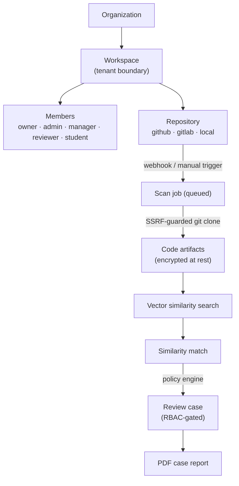

</details>

Every tenant‑scoped route passes through a single `require_workspace_access` authorization chokepoint; cross‑tenant access (IDOR) is rejected with `403`. Webhooks are verified by HMAC signature (`X-Hub-Signature-256` / GitLab token) and de‑duplicated against replay.

<details>
<summary><b>Admin CLI</b></summary>

```bash
python enterprise_cli.py create-organization --name "Acme"
python enterprise_cli.py create-workspace --organization-id 1 --name "Course CS101"
python enterprise_cli.py create-repository --workspace-id 1 --provider github \
    --name app --clone-url https://github.com/acme/app.git
python enterprise_cli.py enforce-retention --dry-run     # honors retention_days + legal_hold
python enterprise_cli.py migrate-encryption --dry-run    # re-encrypt legacy ciphertext to v2
```

</details>

---

## Data model

<div align="center">
  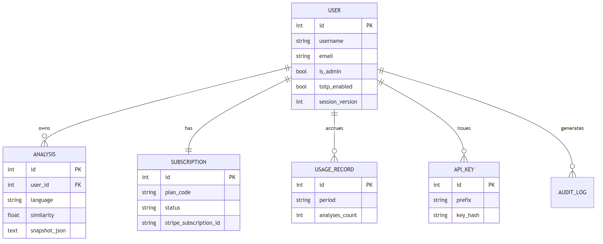
</div>

<details><summary><sub>Diagram source (Mermaid) — renders live on GitHub</sub></summary>

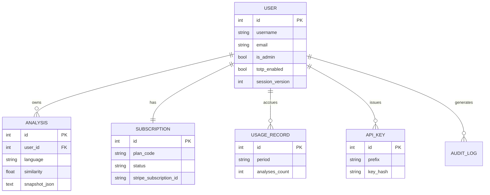

</details>

---

## API

**[`docs/API.md`](docs/API.md)** is the developer guide for the **public API** (API keys + the CI/CD similarity endpoint) with auth, limits, error codes, and copy‑paste examples (cURL / GitHub Actions / Python / Node). The full machine‑readable surface is in **[`docs/openapi.yaml`](docs/openapi.yaml)** (68 paths) — regenerate it from the live route table with `python tools/generate_openapi.py`.

| Group | Base | Examples |
|---|---|---|
| Auth | `/api/v1/auth` | `login`, `signup`, `2fa/*`, `reset-password`, `logout-all` |
| Analysis | `/api/v1/analysis` | `POST /`, `progress`, `task/{id}`, `diff` |
| History | `/api/v1/history` | list, detail, `{id}/rerun`, delete |
| Billing | `/api/v1/billing` | `plans`, `summary`, `checkout`, `portal`, `webhook` |
| Account | `/api/v1/account` | `export` (GDPR), `delete` |
| CI gate | `/api/v1/ci/check` | similarity gate for pull requests |
| Enterprise | `/api/enterprise/v1` | orgs, workspaces, repositories, scans, cases, webhooks |

<details>
<summary><b>Example — CI/CD similarity gate</b></summary>

```bash
curl -X POST https://your-host/api/v1/ci/check \
  -H "X-API-Key: $CI_API_KEY" -H "Content-Type: application/json" \
  -d '{
        "threshold": 80,
        "language": "python",
        "pairs": [{ "label_a": "a.py", "code_a": "...", "label_b": "b.py", "code_b": "..." }]
      }'
# -> { "verdict": "fail", "violations": 1, "results": [ ... ] }
```

</details>

---

## Deployment

| Target | Command / notes | TLS |
|---|---|:--:|
| **Single container (Coolify / PaaS)** | Build the root `Dockerfile` → port `5000` | proxy‑provided |
| **Docker compose (dev)** | `docker/docker-compose.yml` — SQLite, source‑mounted | — |
| **Docker compose (prod)** | `docker/docker-compose.prod.yml` — Postgres + Redis + scan worker | terminate in front |
| **Turnkey + auto‑HTTPS** | `docker/docker-compose.caddy.yml` — Caddy + Let's Encrypt | ✅ automatic |

Follow the step‑by‑step **[deployment runbook](docs/DEPLOYMENT.md)** for domain/TLS, SMTP, and Stripe (test → live) with a go‑live checklist.

> [!IMPORTANT]
> Behind any reverse proxy, set `TRUST_PROXY_HEADERS=1` (one hop) so per‑client rate limiting and `https` URLs work, and keep `SESSION_COOKIE_SECURE=1`. On Coolify, mount a persistent volume at `/app/instance` and set `APP_BASE_URL` to your HTTPS domain.

---

## Security

<table>
<tr><td valign="top" width="50%">

**Application**
- Same‑origin only · strict CSP (`script-src 'self'`, no `unsafe-inline`)
- CSRF token on all mutating requests
- SameSite + `Secure` + `HttpOnly` session cookies
- HSTS over TLS · `X-Frame-Options: DENY` · `nosniff`
- DOMPurify sanitizes all AI‑generated HTML

</td><td valign="top" width="50%">

**Platform**
- TOTP 2FA · brute‑force lockout · session invalidation
- Per‑user API keys (hashed) · scoped enterprise keys
- SSRF‑guarded git access · host allowlist
- HMAC‑keyed audit log · encrypted enterprise data at rest
- GDPR export/delete · retention + legal‑hold

</td></tr>
</table>

Found a security issue? Please open a private report rather than a public issue.

---

## Testing

```bash
pip install -r requirements-dev.txt
pytest tests/                              # backend + enterprise suites
cd code-sleuth-react-ui && npm run test    # Vitest unit tests
npm run e2e                                # Playwright end-to-end
```

CI (`.github/workflows/ci.yml`) runs the backend suite with coverage, a frontend lint/typecheck/build, and validation builds of both Docker images.

---

## Project structure

```
CodeClone/
├── wsgi.py                    # WSGI entry point (production)
├── backend/                   # Modular Flask app
│   ├── app_factory.py         #   create_app() — extensions, blueprints, middleware
│   ├── config.py              #   environment-driven configuration
│   ├── api/v1/                #   versioned REST endpoints
│   ├── engine/                #   clone-detection + AI similarity engine
│   ├── services/              #   business logic (analysis, billing, audit, 2FA…)
│   ├── models/                #   SQLAlchemy models
│   └── tasks/                 #   background analysis workers
├── enterprise_platform/       # Multi-tenant module (models, routes, scans, services)
├── enterprise_worker.py       # Standalone scan-queue worker
├── enterprise_cli.py          # Admin CLI
├── code-sleuth-react-ui/      # React 18 + Vite + TypeScript SPA
├── evaluation/                # Labeled dataset + threshold-calibration harness
├── tools/generate_openapi.py  # Regenerate docs/openapi.yaml from live routes
├── docker/                    # Dockerfiles, nginx, compose stacks
├── docs/                      # Deployment runbook, testing, OpenAPI
└── tests/                     # Pytest suite (backend + enterprise)
```

---

## Roadmap & limitations

- 🟡 **Type‑4 / cross‑language** detection is advisory — better embeddings are the next step.
- 🟢 **Horizontal scale:** set `REDIS_URL` and the coordination backend auto‑shares task/progress state across replicas.
- 🟢 **Schema:** SQLite for dev, PostgreSQL + Alembic for production.
- 🔭 **Next:** a full re‑queueing worker system (a crashed replica mid‑analysis currently means the user retries).

---

## License

**All rights reserved.** © CodeClone. See the repository owner for usage terms.

<div align="center"><br/><sub>Built with tree‑sitter, UniXcoder, Flask, and React.</sub></div>
